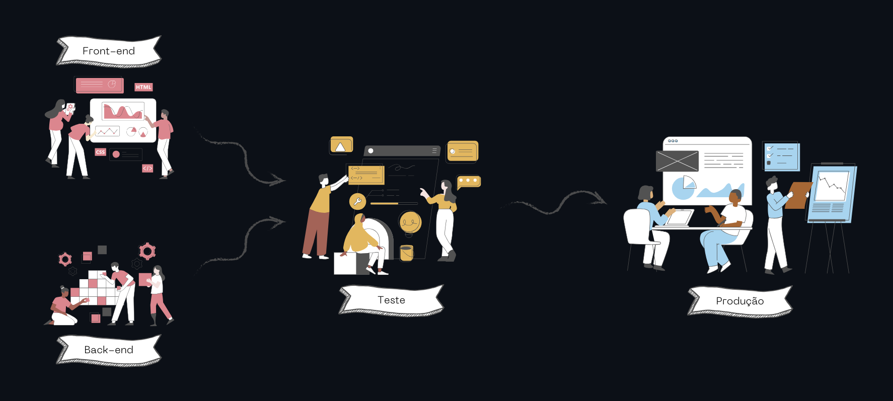

# Ambiente produção

Instale os pacotes essenciais:

```
curl -fsSl https://get.docker.com | bash;
```

## Configuração .env

Copie e edite o arquivo exemplo preenchendo a variável SERVER_IP com o endereço IP do servidor:

```
cd ./django
cp .env-example .env

cd ./front
cp .env-example .env
```

Além do .env nos diretórios, precisa ter um principal, para uso do docker-compose, então copie as variáveis presentes nos dois arquivos .env anteriores e crie um env na raiz do projeto:

```
cat ./django/.env ./front/.env > .env
```

OBS: Remova a variável SERVER_IP duplicada.

## Executar da aplicação

Execute o arquivo compose no servidor:

```
docker compose up -d
```

# Ambiente desenvolvimento

## Ajuste as permissões docker:

```
sudo usermod -aG docker $USER
sudo chmod 666 /var/run/docker.sock
```

## Build e execução

Crie um diretório e baixe os arquivos da aplicação:

```
mkdir -p /var/www/ssl/
git clone https://github.com/GabrielBatistaCco/ssl.git /var/www/ssl/
```

## Build front-end

```
cd /var/www/ssl/front
npm install
nuxt generate
```

## Build das imagens docker

```
cd /var/www/
docker compose build -f dev-compose.yml --no-cache
```

## Execução dos serviços

```
cd /var/www/
docker compose -f dev-compose.yml up -d
```

# Fluxo de entrega do software

Cada etapa do fluxo é uma ramificação no desenvolvimento do software:



- **Front-end e Back-end**: Ramificações distintas, pois os desenvolvimentos são isolados, permitindo serem execudados em paralelo com segurança de que um não afatará no outro.

- **Teste**: Versão unificada do front-end com o back-end, onde podemos testar sua integração e as funcionlidades programadas.

- **Produção**: A versão disponibilizada para os usuários utilizarem.